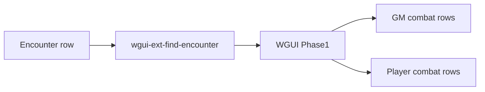

# Player combat view

This stays entirely in WGUI. Wanderer’s Guide, including stock `find-encounter` and encounter RLS, is not changed. Do not add a redacted encounter API or write a redacted copy back.

The player restriction is **how Phase 1 draws** the full payload, not a different fetch. Scope is the Phase 1 encounter workspace (`src/pages/phase1/Phase1Workspace.tsx`) only. Do not change the Mantine campaign `EncountersPanel`.

Implementation of the two todos below can wait until after a GM combat session. This document cannot affect the GM UI.

## How the player sees a campaign encounter

A player cannot use stock `find-encounter`. Encounter RLS is owner-only, so that call returns `[]` for anyone who is not `encounter.user_id`.

Phase 1 already prefers `wgui-ext-find-encounter` with `campaign_id`. That overlay authorizes the GM or a joined PC, then reads the **full** row with the service client.

Live allied PC names and HP also depend on `wgui-ext-find-campaign-characters`. Without it, a player only gets their own characters from stock `find-character`, and teammates render from the stale combatant snapshot.

This is display restriction, not ACL: the JSON still contains HP, dead enemies, and full names. DevTools can still see them.

The same payload feeds both drawings. Player mode is a `!isGm` render flag. The GM branch is the identity path: no new helpers, same rows, full names, signed save bonuses, HP, Open, full log, dead enemies still listed.

## GM combat risk

Combat, Dice, Open, and the round log share `CombatantGrid` and `InitiativeRoundLogPanel`. A missed `isGm` check would hide HP, drop dead enemies, show save DCs, remove Open, or collapse the log for the GM.

After any UI change, verify GM combat first: dead enemies visible, HP editable, Open/inspector, log expanded, dice HP column.

## Player mode: row policy

A player sees **full** party rows: every PC and every ally creature, the same as the GM for those combatants (name, initiative, signed defenses, HP, conditions, inspector). Only enemy creatures are abbreviated.

- **PCs** (`CHARACTER`): full row. Name, initiative, conditions, signed defenses (`AC | Fort +N, Ref +N, Will +N`), HP. Stay on the grid at 0 HP. Open the inspector and the full sheet (row, name, conditions, sheet link). The owner can edit that sheet; every other party member sees it read only. Keep the `Level N | Ally` subtitle.
- **Ally creatures** (`CREATURE` and `ally`): full row, same as PCs — name, initiative, signed defenses, HP, conditions; stay on the grid at 0 HP; open the inspector read only.
- **Enemy creatures** (`CREATURE` and not ally): living only. Hide when `hp_current` is 0 or below. A missing `hp_current` is still alive (the GM grid shows that as full HP). Omit without renumbering survivors, so dead `ML(1)` and `ML(3)` disappear and `ML(2)` remains `ML(2)`. Initials label, initiative, conditions. Defenses cell is a dash. Hide HP. Hide the `Level N | Enemy` subtitle. Not clickable; do not open the inspector.

The Dice tab uses the same `CombatantGrid` rules.

## Enemy label helper

Used only when `!isGm`.

1. Peel a trailing instance suffix: ` (n)` or a space plus digits (`Reefclaw 1`).
2. Split the remainder on spaces and hyphens; take the first letter of each piece, uppercase.
3. Reattach the suffix: parenthetical stays `(n)`; a trailing space-number is concatenated (`R1`).

Examples:

- `Blue-Ringed Octopus` → `BRO` (no number)
- `Mudjaw Lurkbloom (2)` → `ML(2)`
- `Reefclaw 1` → `R1`
- `Grindylow 1` → `G1`

## Player mode: chrome

- No Open column (players). PCs and ally creatures still open via row/name/conditions. Enemy rows have no open path (`openCombatant`, row click, name, pills).
- Round log expands the same as the GM, but only ally entries are shown. Rounds that contain only enemies are omitted.
- Enemy defenses: AC as the number to roll against; each save as `10 + modifier`.
