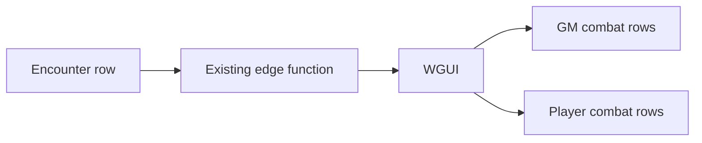

# Player combat view

Yes. This stays entirely in WGUI. Wanderer’s Guide, including `find-encounter` and encounter RLS, is not changed. WGUI already gets the full encounter payload; the player restriction is how that payload is drawn.

## Direction

One way, downstream. The encounter is stored once. An existing edge function returns that full row. WGUI does not write a redacted copy back, and Wanderer’s Guide does not learn whether the viewer is a player.

The same payload feeds both drawings. Player mode only chooses which fields to show and blocks opening the log and the creature.

The GM view keeps the full payload: names, bonuses, HP, open, and the combat log. Every player view uses the same component with a player mode.

## Enemy rows

- All PCs stay as they are: name, initiative, defenses, HP, conditions.
- Living enemies only. An enemy at 0 HP or less is omitted, so dead `ML(1)` and `ML(3)` disappear and `ML(2)` remains.
- Label: first letter of each piece split on spaces and hyphens. `Blue-Ringed Octopus` → `BRO` with no number. `Mudjaw Lurkbloom (2)` → `ML(2)`. `Reefclaw 1` → `R1`. `Grindylow 1` → `G1`.
- Show initiative.
- Show defenses as the higher numbers to roll against: AC, and each save as `10 + modifier`.
- Show conditions.
- Hide HP.
- Do not render the open control.
- The combat log block is visible only as a closed strip, and a player cannot expand it.
